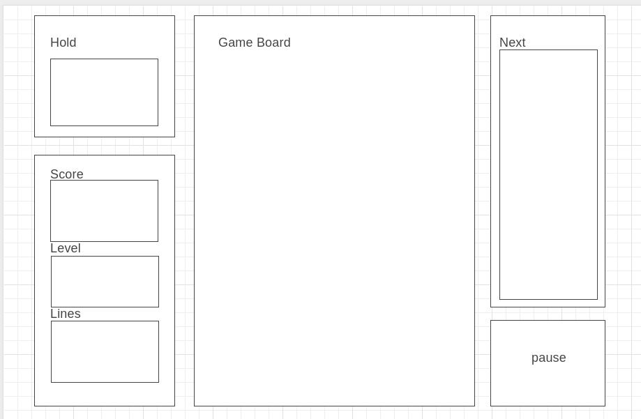

### Functionality and MVPs
Players will be able to: 
* Start, pause, and reset the game
* Move pieces horizontally and down
* Rotate pieces in 90 degree increments

### Wireframes
This app will consist of a start and game screen. The start screen will hold options for starting a game and viewing the controls. The game screen will hold the game board, hold screen, a scoreboard, a next screen, and a pause button.

### Architecture and Technologies
This project will be implemented with the following technologies:
* Javascript for game logic,
* HTML and CSS for graphics
* Browserify to bundle js files

### Implementation Timeline
* Day 1: Setup and create skeleton for project. Completed start screen with limited styling. Functionality for spawning pieces, and ability to start, pause, and quit game.
* Day 2: Handle user input and piece physics
* Day 3: Add styling, score, and user ability to hold pieces. Polish game